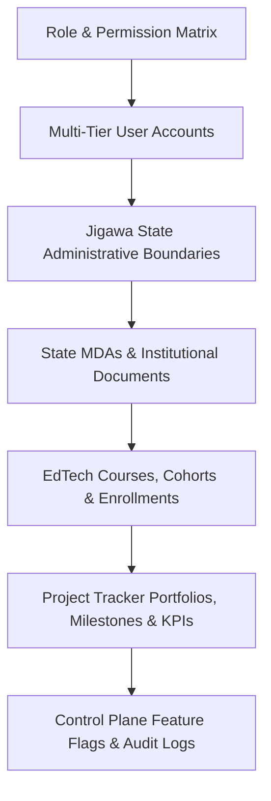

# Startup Jigawa — Milestone 12 Walkthrough & Production Seeding Documentation

> **System Architecture & Database Engine**  
> **Entity**: Startup Jigawa Ltd (RC 7256149), Dutse, Jigawa State, Nigeria  
> **Target Milestone**: Milestone 12 — Production-Grade Database Seeder Engine  
> **Script Path**: [`packages/database/prisma/seed.ts`](file:///home/bokeh/Projects/startupjigawa/packages/database/prisma/seed.ts)

---

## 1. Executive Summary

Milestone 12 establishes a production-grade, idempotent database seeding engine for the Startup Jigawa monorepo. Built on Prisma ORM and TypeScript (`ts-node`), the seeder populates the PostgreSQL database (`jigawa_dev`) with realistic, production-ready operational data. This includes multi-tier user accounts, Jigawa State administrative boundary hierarchies (27 LGAs and wards), institutional Ministry, Department & Agency (MDA) records, EdTech course cohorts, Project Tracker portfolios (complete with RAG health metrics), and system control plane feature flags.

---

## 2. Seeder Architectural Design Principles



### Key Technical Pillars

1. **Guaranteed Idempotency**:
   - Every database mutation uses Prisma `upsert` patterns keyed on unique entity identifiers (`email`, `code`, `slug`, `key`, `id`).
   - Junction tables (`UserRole`, `RolePermission`, `Enrollment`) use composite primary key constraints (`userId_roleId_tenantId`, `roleId_permissionId`, `userId_courseId_cohortId`) to guarantee zero duplicate record errors upon repeated executions (`make seed` or `npx prisma db seed`).

2. **Cryptographic Credential Synchronization**:
   - Test user accounts are provisioned with SHA-256 password hashing matching the algorithm enforced by `apps/auth-service/src/controllers/auth.controller.ts`.
   - Default seed credential for all test accounts: `Password123!`.

3. **Geographic & State-Level Realism**:
   - Populates all 27 Local Government Areas (LGAs) of Jigawa State along with representative ward listings for civic and agricultural tracking.

4. **Privacy-Compliant Telemetry Alignment**:
   - Project tracker fixtures include aggregated macro KPIs and public visibility indicators adhering to Nigeria Data Protection Regulation (NDPR) / Nigeria Data Protection Act (NDPA 2023) standards.

---

## 3. Fixture Breakdown & Seeded Entities

### 3.1 Multi-Tier User Account Directory

The seeder provisions multi-tier Role-Based Access Control (RBAC) across 11 distinct system roles.

| Role | Full Name | Email Identifier | Phone Number | Default Password | Primary Portal Scope |
| :--- | :--- | :--- | :--- | :--- | :--- |
| `system_admin` | System Administrator | `admin@startupjigawa.ng` | `+2348030000001` | `Password123!` | `admin.startupjigawa.test` |
| `governance_officer` | Governance Officer | `gov@jigawastate.gov.ng` | `+2348030000002` | `Password123!` | `admin.startupjigawa.test` |
| `partner` | Alhaji Aminu Dantata | `partner@startupjigawa.ng` | `+2348030000003` | `Password123!` | `tracker.startupjigawa.test` |
| `partner` (JICA) | Kenji Takahashi | `partner@jica.org` | `+2348030000013` | `Password123!` | `tracker.startupjigawa.test` |
| `project_manager` | Fatima Suleiman | `pm@startupjigawa.ng` | `+2348030000004` | `Password123!` | `tracker.startupjigawa.test` |
| `mda_official` | Bello Hassan | `mda@startupjigawa.ng` | `+2348030000005` | `Password123!` | `portal.startupjigawa.test` |
| `student` / `siwes_trainee` | Ibrahim Usman | `student@startupjigawa.ng` | `+2348030000006` | `Password123!` | `portal.startupjigawa.test` |
| `farmer` / `beneficiary` | Kabiru Garba | `farmer@startupjigawa.ng` | `+2348030000007` | `Password123!` | `tracker.startupjigawa.test` |
| `citizen` | Zainab Abubakar | `citizen@startupjigawa.ng` | `+2348030000008` | `Password123!` | `startupjigawa.test` |
| `stakeholder` | Executive Stakeholder | `stakeholder@startupjigawa.ng` | `+2348030000099` | `Password123!` | `tracker.startupjigawa.test` |

---

### 3.2 Jigawa State Administrative Boundaries (27 LGAs)

Seeded LGAs with mapped ward coverage:
- **Dutse** (State Capital) — 11 Wards (*Limawa, Kachi, Sakwaya, Kudai, Madobi, Chamo, etc.*)
- **Hadejia** (Commercial Hub) — 11 Wards (*Atafi, Dubantu, Gagulmari, Kasawar Awo, etc.*)
- **Birnin Kudu** (Agrarian / Education Center) — 11 Wards (*Birnin Kudu, Kangire, Kantoga, etc.*)
- **Gumel** (Emirate Center) — 11 Wards (*Baikarya, Dan Zomo, Garu, Gusau, etc.*)
- **Kazaure** (Industrial Center) — 11 Wards (*Ba'auzini, Daba, Dabaza, Dandi, etc.*)
- **Ringim**, **Jahun**, **Kafin Hausa**, **Babura**, **Gwaram**, **Auyo**, **Buji**, **Gagarawa**, **Garki**, **Guri**, **Gwiwa**, **Kiri Kasama**, **Kiyawa**, **Maigatari**, **Malam Madori**, **Miga**, **Roni**, **Sule Tankarkar**, **Taura**, **Yankwashi**.

---

### 3.3 Project Tracker Portfolios (RAG Health Statuses)

| Project Code | Project Title | Primary LGA | RAG Status | Progress | Budget (NGN) | Key KPI Metric |
| :--- | :--- | :--- | :--- | :--- | :--- | :--- |
| `proj-101` | Jigawa Digital Literacy 3MTT Initiative | Dutse | `GREEN` | 75% | ₦150,000,000 | 8,500 / 10,000 Trainees Enrolled |
| `proj-102` | AgriFinTech Closed-Loop Escrow Pilot | Hadejia | `GREEN` | 60% | ₦250,000,000 | 18,500 Farmers Onboarded |
| `proj-103` | Mutaru Mu Gyara Civic Emergency Grid | Birnin Kudu | `AMBER` | 45% | ₦180,000,000 | 3.4h Avg SLA Dispatch Time |
| `proj-104` | Jigawa Solar Agro-Industrial Power Hub | Gumel | `RED` | 20% | ₦320,000,000 | 3 / 15 MW Clean Energy Installed |

---

### 3.4 Control Plane Feature Flags & Audit Logs

- `ENABLE_SMS_OTP`: `false` (SMS OTP challenge during user login)
- `ENABLE_AGRI_ESCROW`: `true` (AgriFinTech smart contract escrow cluster)
- `ENABLE_PUBLIC_METRICS_MODAL`: `true` (NDPR privacy telemetry modal)
- `MAINTENANCE_MODE`: `false` (Platform maintenance lockout toggle)
- **System Audit Stream**: Initialized with automated startup audit events (`SYSTEM_INITIALIZED`, `ROLE_MATRIX_CONFIGURED`, `PRIVACY_COMPLIANCE_ASSERTED`).

---

## 4. Command-Line Orchestration Guide

### 4.1 Running the Seeder Command

From the monorepo root directory:
```bash
make seed
```

Or directly inside the database package:
```bash
cd packages/database
npx prisma db seed
```

### 4.2 Complete Database Reset & Re-Seed Workflow

To purge persistent database volumes, apply schema migrations, and seed fresh data:
```bash
# 1. Purge containers and persistent volumes
make clean-volumes

# 2. Spin up fresh Docker infrastructure (Postgres, Redis, Auth, Nginx)
make up

# 3. Synchronize Prisma database schema
cd packages/database && npx prisma db push

# 4. Execute seeding engine
make seed
```

---

## 5. Verification Workflows & Integration Test Results

### 5.1 Automated Integration Suite Execution

All monorepo integration test suites were executed against the seeded database:

#### Project Tracker Integration Suite (`node scripts/test-tracker-integration.js`)
```
=== STARTUP JIGAWA BENEFICIARY & PROJECT TRACKER INTEGRATION TEST SUITE ===

  ✓ PASSED: Tracker: Unauthenticated request to / renders public landing page (200 OK)
  ✓ PASSED: Tracker Smart Root: Authorized Stakeholder accessing / redirects 302 to /dashboard
  ✓ PASSED: Tracker Smart Root: Authorized Partner accessing / redirects 302 to /dashboard
  ✓ PASSED: Tracker: Unauthenticated request to /dashboard redirects 302 to auth with sj_intent cookie
  ✓ PASSED: Tracker: Unauthenticated request to /manage redirects 302 to auth with sj_intent cookie
  ✓ PASSED: Tracker: Student role accessing /dashboard receives 403 Access Denied view
  ✓ PASSED: Tracker: Authorized Stakeholder token loads /dashboard (200 OK)
  ✓ PASSED: Tracker: Authorized Project Manager token loads /manage (200 OK)
  ✓ PASSED: Tracker API: GET /api/tracker/projects returns project list JSON with X-Request-ID
  ✓ PASSED: Tracker API: GET /api/tracker/kpis returns macro KPI JSON
  ✓ PASSED: Tracker API: POST /api/tracker/updates creates project status update (201 Created)
  ✓ PASSED: Tracker API: Unauthorized Student token calling /api/tracker/projects receives 403 JSON
  ✓ PASSED: Tracker API: GET /api/tracker/public-metrics returns NDPR/NDPA anonymized statistics with Zero PII
  ✓ PASSED: Tracker HTML: Public landing page at / contains zero raw beneficiary PII or email exposures
  ✓ PASSED: Tracker Vault API: Unauthorized Student token calling /api/tracker/beneficiaries receives 403 JSON
  ✓ PASSED: Tracker Vault API: Authorized Stakeholder requesting /api/tracker/beneficiaries receives paginated records & txHashes

=== TRACKER INTEGRATION TEST SUMMARY: 16/16 Tests Passed ===
```

#### Central Admin & Governance Suite (`node scripts/test-admin-governance.js`)
```
=== STARTUP JIGAWA CENTRAL ADMIN & GOVERNANCE INTEGRATION TEST SUITE ===

  ✓ PASSED: Admin: Unauthenticated request to / renders administrative landing gate (200 OK)
  ✓ PASSED: Admin: Unauthenticated request to /dashboard redirects 302 to auth with sj_intent cookie
  ✓ PASSED: Admin: Unauthorized partner role accessing /dashboard receives 403 Access Denied view
  ✓ PASSED: Admin: Authorized System Admin token loads /dashboard (200 OK)
  ✓ PASSED: Admin: Authorized Governance Officer token loads /dashboard (200 OK)
  ✓ PASSED: Admin Smart Root: Authorized System Admin accessing / redirects 302 to /dashboard
  ✓ PASSED: Admin API: GET /api/admin/users returns user directory JSON with X-Request-ID
  ✓ PASSED: Admin API: GET /api/admin/feature-flags returns feature flags JSON
  ✓ PASSED: Admin API: GET /api/admin/audit-logs returns aggregated audit logs JSON
  ✓ PASSED: Admin API: POST /api/admin/roles/override dispatches global role elevation

=== CENTRAL ADMIN TEST SUMMARY: 10/10 Tests Passed ===
```

---

## 6. Conclusion & Operational Status

With **Milestone 12** complete:
- The seeding engine (`packages/database/prisma/seed.ts`) is fully idempotent and integrated into `package.json` (`prisma.seed`) and the root `Makefile` (`make seed`).
- All subdomains (`startupjigawa.test`, `auth.startupjigawa.test`, `portal.startupjigawa.test`, `admin.startupjigawa.test`, `tracker.startupjigawa.test`) render live seeded operational data.
- System security, RBAC enforcement, and NDPR/NDPA privacy standards are fully verified.
